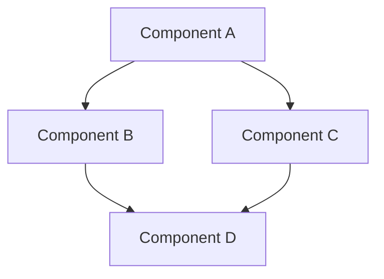
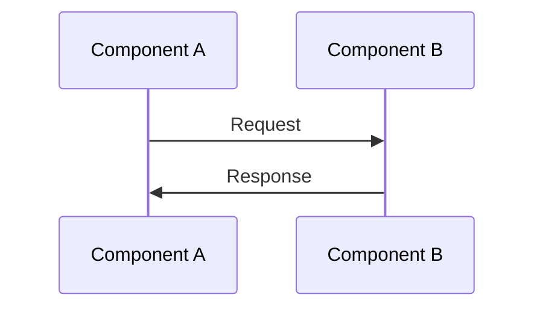
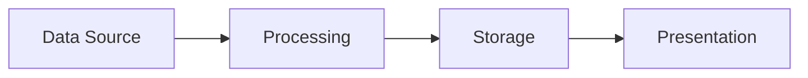
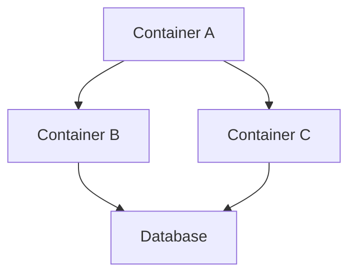

# [Component/System Name] Architecture Documentation

This document describes the architecture of the [Component/System Name] in the ACGS-PGP system.

## Document Metadata

- **Version:** [e.g., 1.0.0]
- **Last Updated:** [YYYY-MM-DD]
- **Author:** [Author Name]
- **Status:** [Draft/Review/Approved]

## Overview

[Provide a high-level overview of the component/system, its purpose, and its role in the overall ACGS-PGP architecture]

## Architecture Diagram

[Include a diagram of the component/system architecture. Use Mermaid or PlantUML syntax for diagrams that can be rendered in Markdown]

## Components

### [Component Name]

[Describe the component, its purpose, and its responsibilities]

#### Interfaces

[Describe the interfaces exposed by the component]

#### Dependencies

[Describe the dependencies of the component]

#### Data Model

[Describe the data model used by the component]

#### Behavior

[Describe the behavior of the component, including any state machines, algorithms, or processes]

## Interactions

[Describe how the components interact with each other and with external systems]

### [Interaction Name]

[Describe the interaction, including sequence diagrams if appropriate]

## Data Flow

[Describe how data flows through the system]

## Deployment

[Describe how the component/system is deployed]

## Security

[Describe the security considerations for the component/system]

## Performance

[Describe the performance considerations for the component/system]

## Scalability

[Describe how the component/system scales]

## Resilience

[Describe how the component/system handles failures]

## Monitoring

[Describe how the component/system is monitored]

## Future Considerations

[Describe any future considerations or planned changes to the architecture]

## References

[List any references or related documents]
